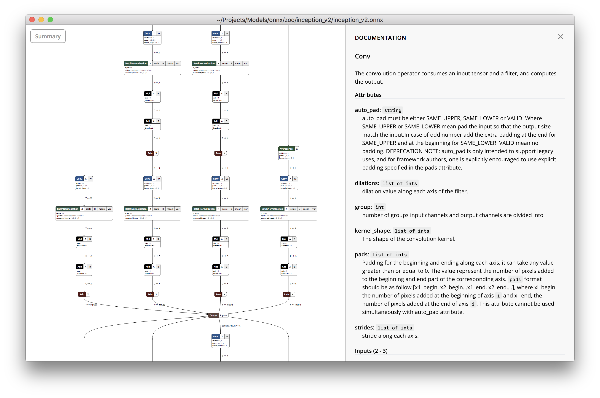
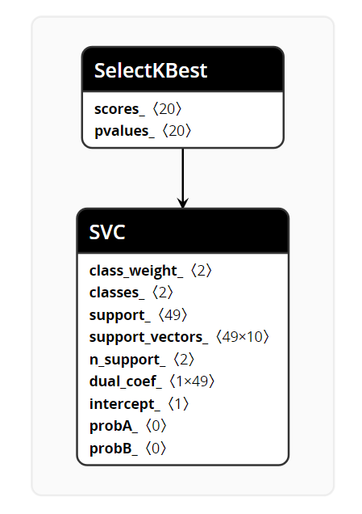
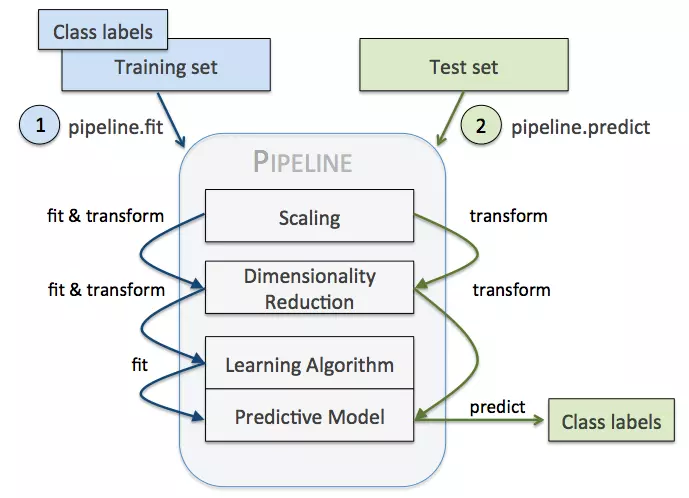

# 模型的导入导出与可视化

## scikit-learn .pkl 格式文件
请参阅`https://stackoverflow.com/questions/34143829/sklearn-how-to-save-a-model-created-from-a-pipeline-and-gridsearchcv-using-jobli`
```python
from sklearn.externals import joblib
joblib.dump(grid.best_estimator_, 'filename.pkl', compress = 1)
```

优点
- 是python对象的持久化库，不局限于sklearn
- 用scikit-learn导出的pkl文件
- 可以dumps为一个内存字符串，也可以dump为一个文件

缺点
- 二进制文件
- 模型参数包含在pkl文件中，不适合人阅读。
- 与python ecosystem 密切

## scikit-learn .joblib 格式文件
优点
- 被sklearn所推荐
- 在包含大量numpy数组时，效率比pickle高
  
缺点
- 只能在磁盘保存文件，不能是内存字符串

## netron项目
一个可视化项目，支持sklearn's .pkl

项目说明：
https://github.com/lutzroeder/netron

演示网站：
https://lutzroeder.github.io/netron/
<p align='center'></a></p>

实例pkl模型：
`anova_svm.pkl`

可视化结果：
<p align='center'></a></p>


# Pipeline

## Pipeline.fit Pipeline.predict

<p align='center'></a></p>